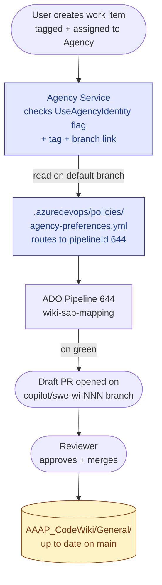
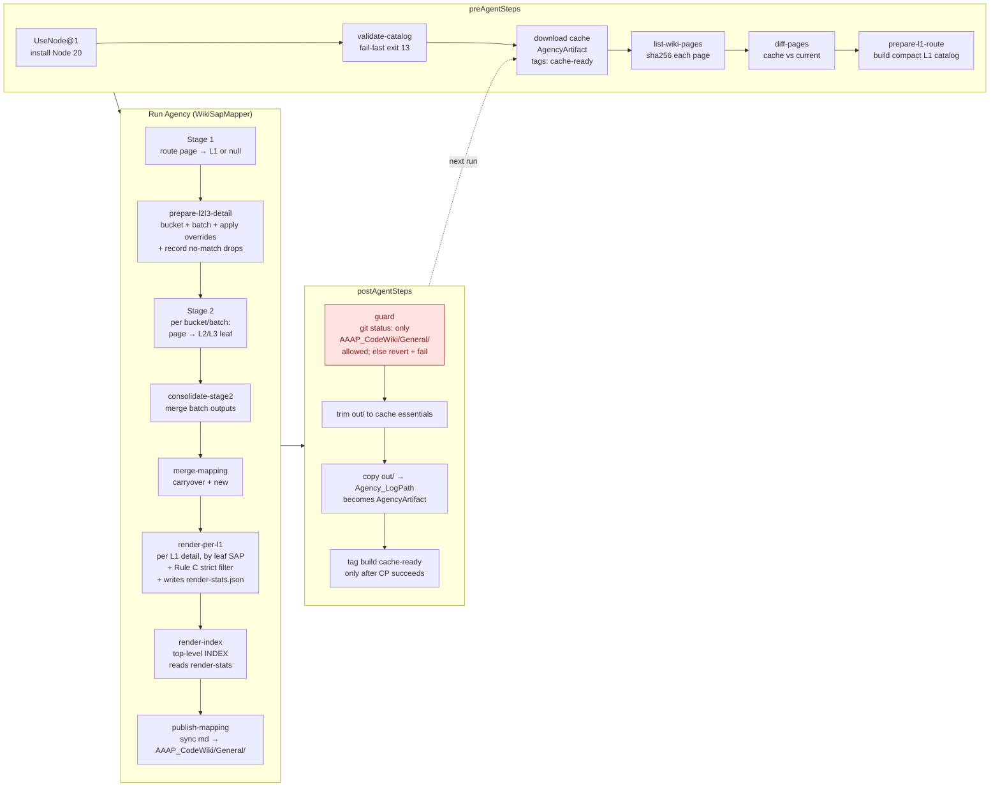
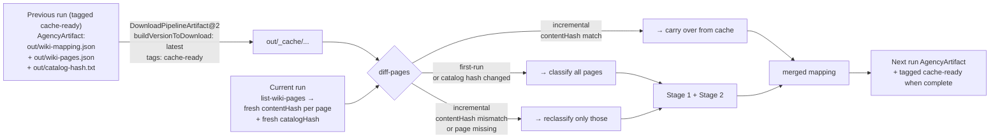

# Wiki ↔ SAP Mapping

Auto-classifies every page of the AAAP Code Wiki against a closed three-level
SAP catalog (**L1 → L2 → L3**, 96 leaves) and **commits the rendered Markdown
reports into `AAAP_CodeWiki/General/` via an Agency-driven pull request** for human
review.

Hash-based incremental cache keeps re-runs cheap: pages whose content hasn't
changed are carried over from the previous successful build; only new or
modified pages are sent through the LLM.

---

## Table of contents

1. [How to trigger a refresh (daily op)](#1-how-to-trigger-a-refresh-daily-op)
2. [Architecture & data flow](#2-architecture--data-flow)
3. [Repository layout (11 files)](#3-repository-layout-11-files)
4. [One-time deployment](#4-one-time-deployment)
5. [Configuration & tunables](#5-configuration--tunables)
6. [Maintenance & troubleshooting](#6-maintenance--troubleshooting)
7. [Design decisions & known limits](#7-design-decisions--known-limits)

---

## 1. How to trigger a refresh (daily op)

The pipeline is **event-driven**: assigning a tagged work item to the Agency
identity triggers a build. Manual `Run pipeline` from the ADO UI does **not**
work (Agency pipelines require an ASA job context that manual runs lack).

### Steps

1. Open ADO → **Boards** → **AAAP_Code** → **New Work Item** → **Task**.
2. Fill in:
   - **Title**: `Refresh wiki SAP mapping <YYYY-MM-DD>`
   - **Tags**: `agency:pipelineTrialMode=true` &nbsp; *(required — without it, Agency falls through to the default Copilot Coding Agent and ignores this pipeline)*
   - **Assigned To**: `Agency` &nbsp; *(service principal, id starts `e329845e-a08b-…`)*
   - **Development pane** → **Add link** → **Branch** → `AAAP_Code / main`
3. **Save**.

### What happens next (no further action needed)

| ~Time after save | Event |
|---|---|
| 1–2 min | Agency picks up the assignment and posts the build link in the work-item Comments |
| 5–30 min | Pipeline runs: `validate-catalog` → cache fetch → `list-wiki-pages` → diff → Stage 1 (L1 routing) → Stage 2 (L2/L3 detail) → render → publish |
| At end | Agency commits the new Markdown to a fresh feature branch `copilot/swe-wi<NNNN>-<hash>` and opens a **draft PR** scoped to `AAAP_CodeWiki/General/**` |
| You | Review the PR → approve → merge |

### Special cases

- **Wiki content unchanged since last run** → `publish-mapping` reports `no markdown changes` and Agency abandons the empty PR. **No action needed.**
- **Build fails** → see [§6.3 Troubleshooting matrix](#63-troubleshooting-matrix).
- **PR contains files outside `AAAP_CodeWiki/General/`** → guard step should have prevented this; **abandon PR immediately, do not merge**, file platform bug.

---

## 2. Architecture & data flow

### 2.1 End-to-end overview



### 2.2 Inside the pipeline run



### 2.3 Cache mechanism



**Cache invalidation rules** (in `wiki-sap.mjs/cmdDiffPages`):

| Trigger | Effect |
|---|---|
| First run (no `_cache/wiki-mapping.json`) | Classify all pages |
| Any catalog or override edit (`catalog-hash.txt` differs) | Classify all pages |
| Page's `contentHash` matches cached entry | Carry classification over |
| Page's `contentHash` differs or page missing in cache | Reclassify page |

**Why the `cache-ready` tag**: A build's AgencyArtifact only exists if
`postAgentSteps` ran to completion (the `copy out/ → Agency_LogPath`
step is what makes the artifact). Before tagging, `latest` could
resolve to a build that errored mid-postAgentSteps — found, but
`Artifact AgencyArtifact was not found` on download → every run
became a cache-miss. The last postAgentStep tags the build only
**after** the artifact is in place, so the next run's
`tags: cache-ready` filter only sees builds with a real artifact.

### 2.4 No-match handling

Stage 1 may emit `l1: null` when no SAP is a reasonable match. These pages:

1. Are recorded as `source: "no-match"` entries in `wiki-mapping-overrides.json`
2. **Bypass Stage 2** entirely (no LLM cost)
3. **Cached** for future runs (won't be re-evaluated until catalog or page content changes)
4. **Dropped from the report** entirely — not shown in INDEX or any per-L1 file (counted under "Wiki pages not included" in the INDEX Summary)

There is **no** `Other > Other > Uncategorized` catch-all leaf — by design, unfit pages are silent drops, not noise bucket entries.

### 2.5 Strict relevance filter (Rule C)

After Stage 2 picks a leaf for each page, two **code-enforced sanity checks** are applied at render time before a page actually shows up in a per-L1 detail file:

| Check | Where | Logic | Tunables |
|---|---|---|---|
| **Composite Score gate** | `cmdRenderPerL1 / applyStrictFilter` | AI-source entries below `MIN_LEAF_SCORE_AI` (default 0.55) are dropped; `override`, `rule`, `title-match`, and `leaf-fallback` sources always pass | `MIN_LEAF_SCORE_AI` |
| **Token-threshold keyword match** | same | For each leaf keyword, multi-word phrases pass if ≥ `ceil(N × KEYWORD_TOKEN_RATIO)` of their significant tokens (length ≥ 3, non-stopword) appear as `\b…\b` whole words in `title + path + content`. Single-word keywords still need exact whole-word match | `KEYWORD_TOKEN_RATIO` (default 0.66) |
| **L3 title-match injection** | `cmdRenderPerL1` (pre-filter step) | If a page's title contains the leaf's full L3 phrase (singular/plural-tolerant on the last token, whole-word boundary), the page is injected into that leaf with `source: "title-match"`, score `TITLE_MATCH_SCORE` (default 0.90). Bypasses keyword check. The page also stays in whatever leaf Stage 2 originally chose — both copies render | `TITLE_MATCH_SCORE` (0.90) |
| **Cross-leaf lexical fallback** | `cmdRenderPerL1` (pre-filter step, runs ONLY on still-empty leaves) | For leaves that have **no** Stage-2 entries and no title-match copies, scan all same-L1 pages and inject the top `FALLBACK_MAX` by lexical fit (title hit ×1.0 + path ×0.4 + body ×0.15 across L3+L2+keyword tokens). `source: "leaf-fallback"`, confidence in [0.40, 0.70]. **Purely additive** — never removes or alters entries other layers captured. If 0 same-L1 pages share any token with the leaf, it stays empty (genuine content gap) | reuses `FALLBACK_MAX` |
| **Per-leaf cap + per-leaf fallback** | same | After the above pass, top `PER_LEAF_CAP` (20) by score render. If 0 entries pass for a leaf, keep top `FALLBACK_MAX` (2) by raw score so the section isn't empty | `PER_LEAF_CAP`, `FALLBACK_MAX` |

These are **layered on top of the AI's content-based judgment** (Stage 2 reads the page's full content and gives a confidence). They do not replace the AI — they prevent a confident-but-wrong AI guess from crowding out the genuinely on-topic pages, catch obvious "the title says X, the page should be under leaf X" cases the AI sometimes misroutes, and (via cross-leaf lexical fallback) ensure every catalog leaf shows at least the closest-matching page rather than rendering empty. See `[render-per-l1] strict filter (Rule C, …)`, `[render-per-l1] title-match injection: …` and `[render-per-l1] leaf-fallback injection: …` log lines for per-run counts.

### 2.6 5-layer write-scope defense

The agent is allowed to write only `AAAP_CodeWiki/General/**` and `out/**`. Multiple layers protect every other path (especially the rest of `AAAP_CodeWiki/` Code Wiki content):

| # | Layer | Type | Where |
|---|---|---|---|
| 1 | Agent persona Safety Rules | Soft (prompt) | `.github/agents/wiki-sap-mapping.agent.md` |
| 2 | preToolUse hook | Hard (script-level deny) | `.github/hooks/scripts/pre-tool-guard.ps1` |
| 3 | Post-Agent git-status guard | Hard (server-side revert + fail build) | step in `wiki-sap-mapping-pipeline.yml` |
| 4 | `.gitignore` (out/) | Hard (git tree) | `.gitignore` |
| 5 | Branch policy + PR review | Process | ADO branch policies |

Layer 3 is the deterministic backstop: even if every other layer fails, `git status` enumerates all modified files; anything outside `AAAP_CodeWiki/General/` triggers `git checkout --` revert and `exit 99`.

---

## 3. Repository layout (11 files)

```
.azuredevops/
└── policies/
    └── agency-preferences.yml          # routes Agency to our pipelineId (path FIXED by Agency)

.pipelines/
├── wiki-sap-mapping-pipeline.yml       # 1ES.Agency pipeline definition
└── wiki-sap-mapping/
    ├── wiki-sap.mjs                    # 10-subcommand CLI (validate-catalog, list-wiki-pages,
    │                                   #  diff-pages, prepare-l1-route, prepare-l2l3-detail,
    │                                   #  consolidate-stage2, merge-mapping, render-index,
    │                                   #  render-per-l1, publish-mapping)
    └── config/
        ├── sap-catalog.json            # 96 leaves across 5 L1s — closed set, human-curated
        └── wiki-sap-overrides.json     # {wikiPath: "L1 > L2 > L3"} manual overrides

.github/
├── agents/
│   └── wiki-sap-mapping.agent.md       # WikiSapMapper persona (5-step workflow + Safety Rules
│                                       #  + Stage 1/2 prompts inlined — no separate SKILL files)
└── hooks/
    ├── copilot-hooks.json              # preToolUse manifest
    └── scripts/
        └── pre-tool-guard.ps1          # hard-deny writes outside AAAP_CodeWiki/General/ + out/

AAAP_CodeWiki/                          # Code Wiki content (read-only by agent EXCEPT under General/Wiki-SAP-Mapping/)
└── General/                            # AGENT-GENERATED under this scope — never edit the auto-generated files by hand
    ├── Wiki-SAP-Mapping.md             # INDEX page
    └── Wiki-SAP-Mapping/               # one per L1 with classified pages
        ├── Wiki-SAP-Mapping-Azure-Arc-enabled-servers.md
        ├── Wiki-SAP-Mapping-Azure-Automation.md
        └── …

.gitignore                              # blocks out/ from any PR
README.md                               # this file
```

---

## 4. One-time deployment

Setting up the pipeline from scratch is **5 phases** in order. Each phase has a
single check at the end before moving on.

### Phase A — Prerequisites (verify before starting)

| Check | How to verify | Fix if missing |
|---|---|---|
| GitHub Copilot Enterprise is active for your account | https://github.com/settings/copilot shows "GitHub Copilot Enterprise is active" | Request a seat from your admin |
| **AAAP_Code** is onboarded to Agency (`UseAgencyIdentity` flag = true) | A test work item assigned to Agency renders comments as **Agency** (not "GitHub Copilot"). If renders as Copilot → not onboarded | Open SR via Viva Engage "Agency" community (see §6.5) |
| You can edit ADO Pipelines + Repositories Security in AAAP_Code | `https://dev.azure.com/supportability/AAAP_Code/_settings/` shows full settings menu | Request Project Admin from the project owner |

### Phase B — Commit application files to `main`

Application files to commit (everything in [§3](#3-repository-layout-11-files) except auto-generated `AAAP_CodeWiki/General/**`):

```
.azuredevops/policies/agency-preferences.yml    (pipelineId placeholder — filled in Phase D)
.github/agents/wiki-sap-mapping.agent.md
.github/hooks/copilot-hooks.json
.github/hooks/scripts/pre-tool-guard.ps1
.gitignore
.pipelines/wiki-sap-mapping-pipeline.yml
.pipelines/wiki-sap-mapping/wiki-sap.mjs
.pipelines/wiki-sap-mapping/config/sap-catalog.json
.pipelines/wiki-sap-mapping/config/wiki-sap-overrides.json
README.md
OVERVIEW.md
```

Open a PR, get it reviewed, merge to `main`.

**Check**: `main` contains all the above. Don't move on until merge is complete.

### Phase C — Register the ADO pipeline

1. ADO → `https://dev.azure.com/supportability/AAAP_Code/_build` → **New pipeline**
2. **Azure Repos Git** → `AAAP_Code` → **Existing Azure Pipelines YAML file**
3. Path: **`/.pipelines/wiki-sap-mapping-pipeline.yml`**
4. Click **Save** — ⚠️ **do NOT click Run** *(Agency pipelines fail manual runs with ASA 404)*
5. Rename the pipeline to **`wiki-sap-mapping`**
6. From the pipeline URL note the `definitionId` (e.g. `?definitionId=644` → `644`)

**Check**: pipeline appears in Pipelines list with name `wiki-sap-mapping`, has the `definitionId` you noted.

### Phase D — Wire `pipelineId` into Agency

Edit `.azuredevops/policies/agency-preferences.yml`, replace `pipelineId` with the value from Phase C step 6:

```yaml
configuration:
  agencyPreferences:
    pipelineConfig:
      organization: supportability
      projectId: 6e1f91fa-9d05-431a-84a6-b7254ac681fa
      pipelineId: 644                # ← from Phase C step 6
      pipelineTrialMode: true        # ← keep true PERMANENTLY (see §6.2)
```

Commit to `main`. **Wait 1–3 min** for Agency to re-index the policy.

**Check**: file content on `main` matches above with your `pipelineId`.

### Phase E — First dispatch (smoke + baseline)

Follow [§1](#1-how-to-trigger-a-refresh-daily-op) to create the trigger work item.

- First run has no cache → **classifies ALL wiki pages → 15–30 min**.
- First PR contains `AAAP_CodeWiki/General/Wiki-SAP-Mapping.md` (INDEX) + `AAAP_CodeWiki/General/Wiki-SAP-Mapping/Wiki-SAP-Mapping-<L1>.md` (one per L1 with classified pages).
- **Review carefully — this is your baseline.** Spot-check 10–20 leaves to confirm the classifications look reasonable.
- Merge.

**Check**: PR merged, `AAAP_CodeWiki/General/` exists on `main` with content. From now on, daily ops follow [§1](#1-how-to-trigger-a-refresh-daily-op) only.

### Phase F (optional but recommended) — Branch policy on `main`

ADO → Repositories → `AAAP_Code` → Branches → `main` → Branch policies → require at least 1 reviewer on PR merge. This is Layer 5 of the [defense chain](#26-5-layer-write-scope-defense).

---

## 5. Configuration & tunables

### 5.1 Edit the SAP catalog

`.pipelines/wiki-sap-mapping/config/sap-catalog.json` — JSON array of leaf objects:

```json
{
  "l1": "Azure Automation",
  "l2": "Runbook not working as expected",
  "l3": "My job is stuck in the running state and can't be stopped",
  "description": "Plain-English description of when this leaf applies; the agent uses this as the primary semantic signal in Stage 2.",
  "keywords": ["unique", "phrases", "appearing", "in pages this leaf claims"]
}
```

Rules enforced by `validate-catalog` (hard fail, exit 13):

| Rule | Why |
|---|---|
| All 5 required fields per leaf, correct types | Stage-2 prompt depends on this |
| `(l1, l2, l3)` triples globally unique | Distinct leaves |
| `keywords` globally unique (case-insensitive) across all leaves | Stage-2 keyword rule needs unambiguous ownership |
| All `wiki-sap-overrides.json` triples map to a catalog leaf | Drift would silently break overrides |

L2-only SAPs (no L3 distinction): set `l3: "(General)"` — renderer treats `(General)` as the sentinel and emits `L1/L2` heading without an L3 segment.

ANY edit to `sap-catalog.json` or `wiki-sap-overrides.json` changes `catalogHash` → invalidates the entire cache → next run re-classifies all pages. Bundle catalog edits together to avoid repeated full rebuilds.

### 5.2 Manual overrides

`.pipelines/wiki-sap-mapping/config/wiki-sap-overrides.json`:

```json
{
  "/Azure-Arc/Onboarding/Connect-machines-using-Azure-portal": "Azure Arc > Onboarding > Connecting to Arc",
  "_comment": "Keys starting with underscore are skipped — used for inline comments"
}
```

Overrides take precedence over AI classification. Use sparingly — for pages where the AI keeps mis-classifying despite good keywords/description.

### 5.3 Pipeline env vars (set in ADO Pipeline UI → Variables, not YAML)

| Variable | Default | Effect |
|---|---|---|
| `MAX_PAGES_PER_BUCKET_BATCH` | 50 | Stage-2 per-batch cap. Lower if hitting LLM context limits on big buckets |
| `STAGE1_EXCERPT_CHARS` | 1500 | Per-page excerpt size for Stage-1 prompt. Lower if Stage 1 hits context limit |
| `WIKI_CONTENT_CHAR_LIMIT` | 8000 | Per-page truncation for Stage-2 content. Lower for huge wikis |
| `PER_LEAF_CAP` | 20 | Max wiki pages shown per leaf SAP in per-L1 md |
| `VISIBLE_PER_LEAF` | 5 | Rows visible before "More" details fold |
| `MIN_LEAF_SCORE_AI` | 0.55 | Rule C strict filter: AI-source entries below this composite score are dropped from per-L1 detail pages |
| `KEYWORD_TOKEN_RATIO` | 0.66 | Rule C strict filter: for multi-word keyword phrases, fraction of significant tokens that must hit (whole-word, non-adjacent). Lower → more permissive |
| `AI_CAP_NO_TITLE_HIT` | 0.55 | **[Deprecated]** Not applied after rollback. Kept in CONST for backward compat; change has no effect |
| `AI_CAP_ONE_TITLE_HIT` | 0.70 | **[Deprecated]** Not applied after rollback. Kept in CONST for backward compat; change has no effect |
| `TITLE_MATCH_SCORE` | 0.90 | Score given to `source: title-match` injections (page whose title contains the leaf's full L3 phrase, singular/plural-tolerant). Bypasses keyword filter |
| `FALLBACK_MAX` | 2 | If 0 pages pass Rule C for a leaf, keep top-N by score so the section isn't empty |

Pipeline-side ADO secrets (auto-injected, not configurable):
`Agency.Consent.AAAP_Code`, `Agency_Context`, `Agency_LogPath`, `System.AccessToken`.

### 5.4 Agency-preferences fields

| Field | Value | Notes |
|---|---|---|
| `organization` | `supportability` | ADO org short name |
| `projectId` | GUID | Project Settings → Overview → Project ID (NOT name) |
| `pipelineId` | Integer | Pipeline `definitionId` from URL |
| `pipelineTrialMode` | **`true` (permanent)** | See [§6.2](#62-why-pipelinetrialmode-stays-true) |

Path is **fixed** by Agency service at `.azuredevops/policies/agency-preferences.yml` — do not move.

---

## 6. Maintenance & troubleshooting

### 6.1 Regular maintenance tasks

| Cadence | Task | How |
|---|---|---|
| Weekly | Trigger a refresh dispatch | Follow [§1](#1-how-to-trigger-a-refresh-daily-op). Review the PR; merge if classifications look good. Wiki changes since last run → most pages cache-hit, only changed ones re-classified |
| When wiki page mis-classifies repeatedly | Add a manual override | Edit `wiki-sap-overrides.json`, commit, next run picks it up |
| When org adds/renames products | Edit catalog | Edit `sap-catalog.json`, commit; **expect full cache rebuild** (catalog hash change). Pre-commit: `node .pipelines/wiki-sap-mapping/wiki-sap.mjs validate-catalog` locally |
| Monthly | Verify Copilot license + Agency dispatch still works | One refresh dispatch end-to-end |
| Quarterly | Sanity-check Top-20-per-leaf coverage | Look for leaves with 20+ pages in per-L1 files (could indicate keyword/description ambiguity) |
| As-needed | Bump Node version | Edit `version: '20.x'` in pipeline yml under `UseNode@1` |

### 6.2 Why `pipelineTrialMode` stays `true`

`agency-preferences.yml` is **repo-wide**, not per-work-item. If you flip `pipelineTrialMode: false`, every Agency-assigned work item in AAAP_Code (anyone's "fix this bug" task assigned to Agency) will route into the wiki-sap-mapping pipeline — wrong behaviour.

`true` + the tag `agency:pipelineTrialMode=true` scopes routing to exactly the work items we mark for wiki mapping refresh. Other Agency-assigned items fall through to default Copilot Coding Agent behaviour, unaffected.

### 6.3 Troubleshooting matrix

| Symptom | Likely root cause | Where to look / Fix |
|---|---|---|
| Comment "GitHub Copilot was not activated" | `UseAgencyIdentity` flag turned off for AAAP_Code, or branding flipped | Open SR via Viva Engage "SWE Agent / Agency" community. Repro: any work item assigned to Agency. Reference internal `copilotSweFeatureFlagsConfiguration.yml`. See §6.5 for support template |
| Pipeline YAML validation fails with `Pipeline Resource ... Must be Valid` | Stale `pipelines:` resource declaring `source: $(System.DefinitionName)` | Remove the entire `resources.pipelines:` block; first run never had a previous build to reference |
| `Unexpected parameter 'outputs'` from Agency template | Tried to use top-level `outputs:` parameter | Agency hides `outputs:` and SDL blocks `PublishPipelineArtifact@1`. Use the auto-published `AgencyArtifact` (Agency publishes `$(Agency_LogPath)` automatically) |
| `git clone . ` fails with "destination already exists" inside Agency clone step | `logPath` pointed under `$(Build.SourcesDirectory)` polluting clone target | Leave `logPath` unset (default `$(Build.StagingDirectory)/agency-logs`). Copy to it in postAgentSteps |
| `Pre-Agent: clone AAAP wiki repo` returns HTTP 403 | Build identity missing Read on the wiki backing repo | (Code Wiki case: not applicable, content is in main repo). If switching to Project Wiki later: Project Settings → Repositories → `<wikiName>.wiki` → Security → grant Read |
| `[validate] sap-catalog.json invalid JSON` or `ENOENT` | Catalog file missing from PR or malformed | Verify file path; run `node wiki-sap.mjs validate-catalog` locally |
| `download previous artifact` says "No builds currently exist" | First run only — no prior build with `cache-ready` tag yet | Expected on first run; `continueOnError: true` lets it pass. Subsequent runs find the tagged build |
| `download previous artifact` says `Artifact AgencyArtifact was not found for build NNN` | Stale code: the download step is using `artifactName: AgencyArtifact` (exact) but the 1ES.Agency template publishes with a decorated name pattern (`AgencyArtifact-{Org}-{Project}-{PipelineId}-{BuildId}`). Fix: omit `artifactName`, use `itemPattern` to pull the JSON cache files from any artifact, then flatten into `_cache/` root | See current pipeline yml — the `download` + `flatten` step pair handles this. If you ever see this error after the fix, check the artifact actually exists on the source build (build page → Related → "X published") |
| Every run keeps doing a full LLM rebuild | (1) cache-ready tag never applied (permission); or (2) the artifact-name mismatch above; or (3) the source build genuinely lacks the artifact | Check `Post-Agent: tag build as cache-ready` log on PRIOR builds. If `Failed to add cache-ready tag`: ADO → Project Settings → Pipelines → Permissions → grant `Edit build quality`. Otherwise compare prior build's artifact name vs what download is requesting |
| `Run Agency` hangs > 30 min or burns excessive tokens | Stage-2 bucket too large for LLM context | Lower `MAX_PAGES_PER_BUCKET_BATCH` pipeline variable (try 25 or 20) |
| Post-Agent `guard` step fails with `Agent modified files outside AAAP_CodeWiki/General/` | Agent went off-script (smoke verified this DOES happen) | Defense worked — wiki + repo files reverted. Investigate `wiki-sap-mapping.agent.md` Safety Rules and whether agent's task got misinterpreted. Re-dispatch |
| PR contains `AAAP_CodeWiki/` changes outside `General/` | Both Layer 2 (hook) AND Layer 3 (guard) failed — should be impossible | **Abandon PR immediately. Do not merge.** File platform bug; share build log of `Post-Agent: guard` step |
| Agency PR title is unrelated ("Correct typos…" etc.) | Agent ignored the inlined prompt and reverted to default Copilot behaviour | Verify `wiki-sap-mapping.agent.md` was actually loaded — check log line "WikiSapMapper persona loaded". If not, abandon PR + investigate dispatch identity |
| `publish-mapping` reports `no markdown changes` on first real run | Bug — should always have changes on first run | Check log of render-index + render-per-l1 produced files. Check publish-mapping's tally output |
| Manual `Run pipeline` from ADO UI fails with ASA 404 | Expected — Agency CLI requires an ASA job ID, manual runs don't have one | Trigger via work item assignment as in §1, never via UI Run button |
| A clearly-relevant wiki page is missing from a leaf's per-L1 section | Rule C / anchor cap filtered it out (low AI confidence, or title doesn't share tokens with leaf keywords) | Inspect `[render-per-l1] strict filter` log line: `kept`/`filteredOut`/`fallback`/`cappedOut` counts. To rescue specific pages, add a manual override in `wiki-sap-overrides.json` (forces `source: override` → score 1.00, bypasses all filters). To loosen globally: lower `MIN_LEAF_SCORE_AI` or raise `AI_CAP_NO_TITLE_HIT` via pipeline UI vars |
| Irrelevant pages crowding out relevant ones in a leaf | AI Stage 2 over-confidently assigned them despite weak title alignment | Two paths: (1) override the relevant pages explicitly to anchor them at score 1.00; (2) lower `AI_CAP_ONE_TITLE_HIT` (e.g. 0.50) to push 1-token-hit pages below the Rule C threshold |

### 6.4 How to inspect the cache

After any successful run, download `AgencyArtifact` from the build page:

```
AgencyArtifact.zip
├── wiki-mapping.json       # canonical mapping, ~5–50 KB per 100 wiki pages
├── wiki-pages.json         # input snapshot with contentHash per page
├── catalog-hash.txt        # 65 bytes — invalidates cache when changed
├── (various Agency CLI log files)
```

To force a full re-classify (e.g., suspect cache corruption): delete `AgencyArtifact` from the latest build via ADO API, or change a single character in `sap-catalog.json` and revert it (changes the hash, invalidates cache).

### 6.5 Escalating Agency platform issues

When the symptom maps to "Agency-side regression / scope change":

1. Post in **Viva Engage** → search for `Agency` community (or fallback to the **SWE Agent** sub-community; both work)
2. Title template: `Agency dispatch [symptom] for supportability/AAAP_Code — repro WI <NNN>`
3. Always include: org/project/repo, pipelineId, work item ID for failure, a working WI ID from previous days, screenshot of failing comments, your Copilot license status
4. Track via the SR number support assigns; hold off on local changes until they confirm scope restored

Sample close-the-loop response template available in repo history (Git commit search "Agency support reply" for past SR exchanges).

---

## 7. Design decisions & known limits

### 7.1 Architecture choices we deliberately made

| Decision | Rationale |
|---|---|
| **Two-stage classification** (L1 router → L2/L3 detail per bucket) | One-shot 96-leaf classification was burning tokens and accuracy. Two stages let each prompt see ≤ 36 leaves max |
| **Hash-based incremental cache** | Wiki changes are sparse week-to-week. Caching cuts steady-state runs to 1–2 min vs 15–30 min full rebuilds |
| **No `Other > Other > Uncategorized` catch-all** | "Other" bucket attracted lazy classifications; explicit no-match drops force the agent to either match a real SAP or admit "no fit" |
| **Stage-2 bucket batching (50 pages default)** | Caps prompt size for very large buckets, idempotent on per-batch output files |
| **Top-20-per-leaf with 5 visible** | Limits per-L1 file size; "More" details keeps full detail accessible without overwhelming default view |
| **Composite Score with anchor cap** | Score blends AI confidence with secondary signals from `reason` text. AI-source entries are then capped based on **title** overlap with the leaf — a model giving 0.93 to a page whose title shares no significant tokens with the leaf gets capped at 0.50 (filtered out), defending against confident-but-wrong matches without throwing away the AI signal |
| **Rule C strict filter** | After Stage 2, code-enforced sanity checks at render time: composite score gate + token-threshold keyword match (multi-word phrases pass via `ceil(N × 0.66)` significant tokens, no adjacency required). Token-level matching catches "same topic, different wording" that integer-phrase matching misses |
| **Title anchor cap on AI scores** | Body and path matches are noisy (folder names, incidental mentions). Title is the strictest curated signal; requiring 1-2 leaf tokens in the title before allowing high AI confidence keeps semantic-but-tangential pages out of leaf top-20 |
| **L3 title-match cross-injection** | If a page's title literally names the leaf's L3 (singular/plural-tolerant), Stage 2 sometimes still routes it to a sibling leaf (e.g. "Deletion of Dynamic Scope fails" → routed to a deletion-error leaf, not "Dynamic Scopes"). The injection rule guarantees those obvious matches show up in the named-after leaf too, regardless of Stage 2's choice |
| **Cross-leaf lexical fallback for empty leaves** | Stage 2 single-assignment + 96 leaves → most leaves get 0 entries. To guarantee every catalog SAP shows a wiki link (UX requirement), a purely additive layer scans same-L1 pages by lexical fit and injects the top-N for empty leaves with `source: "leaf-fallback"`. Touches nothing in non-empty leaves; if an empty leaf has zero candidates with any token overlap, it stays empty (genuine content gap to surface) |
| **Single 40 KB `wiki-sap.mjs` CLI vs 10 separate scripts** | One file to maintain, one syntax check, shared helpers; subcommand dispatch keeps each pipeline step focused |
| **Inlined Stage 1/2 prompts in agent.md vs separate SKILL.md files** | Fewer files; agent persona + prompts live together for atomic edits |
| **`model:` not pinned** | Pinning a specific Claude version (e.g. `claude-opus-4.6`) silently breaks when that version is deprecated. Org default tracks updates automatically |
| **5-layer write-scope defense** | Single layer (prompt) is too soft; combination is bulletproof against any single layer failing |
| **Code Wiki backed by same repo** (vs Project Wiki) | No extra clone step needed in pipeline; wiki content checked out as part of normal Agency source-sync |

### 7.2 Known limits / future work

| Limit | Why it might bite | Mitigation if hit |
|---|---|---|
| Stage 1 not batched | Wikis with > ~2000 pages may exceed Stage 1 prompt context | Add same batching as Stage 2 (`MAX_PAGES_PER_BATCH_STAGE1` env var + chunked input files) |
| PR title controlled by Agency (not us) | Title looks generic, not "wiki-sap-mapping refresh"-specific | Accept — this is platform-level |
| `agency-preferences.yml` is repo-wide, not per-pipeline | Can route only ONE pipeline at a time per repo | If you ever need a second Agency pipeline, you'd need a second AAAP_Code-like repo or pipeline-trial-mode-style scoping |
| No automated schedule trigger | Refresh requires manually creating a work item each time | Add a scheduled ADO pipeline that creates the work item via REST API; or rely on weekly ops cadence |
| Catalog hash invalidates ALL cache | A typo-fix in one leaf description triggers a full rebuild | Accept — catalog edits are rare; clean rebuild ensures consistency |
| Agency activation depends on Microsoft-side flag (`UseAgencyIdentity`) | If admin disables for AAAP_Code, dispatch breaks (already happened once) | Document escalation path (§6.5); maintain SR history for re-enable requests |
| AAAP wiki uses Code Wiki | If wiki ever migrates to Project Wiki, the pipeline must add a clone step + the build identity needs Read on `<wikiName>.wiki` backing repo | Code change documented inline in `wiki-sap-mapping-pipeline.yml` |
