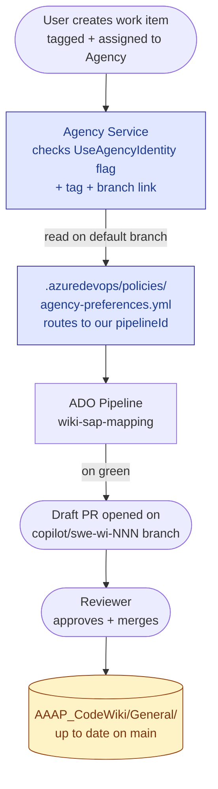
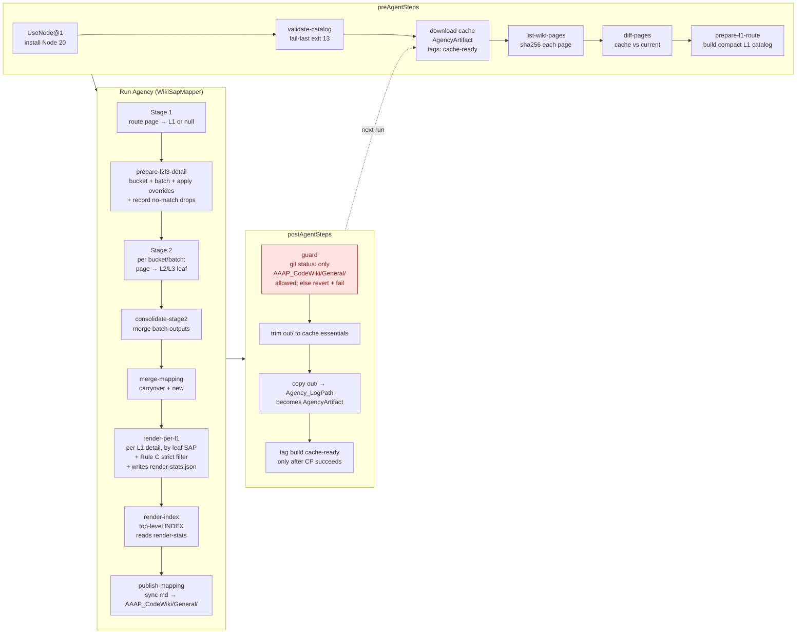

# Wiki ↔ SAP Mapping

Auto-classifies every page of the AAAP Code Wiki against a closed three-level
SAP catalog (**L1 → L2 → L3**, 96 leaves) and **commits the rendered Markdown
reports into `AAAP_CodeWiki/General/` via an Agency-driven pull request** for human
review.

Hash-based incremental cache keeps re-runs cheap: pages whose content hasn't
changed are carried over from the previous successful build; only new or
modified pages are sent through the LLM.

---

## Table of contents

1. [How to trigger a refresh (daily op)](#1-how-to-trigger-a-refresh-daily-op)
2. [Architecture & data flow](#2-architecture--data-flow)
   - [2.1 End-to-end overview](#21-end-to-end-overview)
   - [2.2 Inside the pipeline run](#22-inside-the-pipeline-run)
3. [Configuration & tunables](#3-configuration--tunables)
   - [3.1 Manual overrides](#31-manual-overrides)
4. [Maintenance & troubleshooting](#4-maintenance--troubleshooting)
   - [4.1 Regular maintenance tasks](#41-regular-maintenance-tasks)

---

## 1. How to trigger a refresh (daily op)

The pipeline is **event-driven**: assigning a tagged work item to the Agency
identity triggers a build. Manual `Run pipeline` from the ADO UI does **not**
work (Agency pipelines require an ASA job context that manual runs lack).

### Steps

1. Open ADO → **Boards** → **AAAP_Code** → **New Work Item** → **Task**.
2. Fill in:
   - **Title**: `Refresh wiki SAP mapping <YYYY-MM-DD>`
   - **Tags**: `agency:pipelineTrialMode=true` &nbsp; *(required — without it, Agency falls through to the default Copilot Coding Agent and ignores this pipeline)*
   - **Assigned To**: `Agency` &nbsp; *(service principal, id starts `e329845e-a08b-…`)*
   - **Development pane** → **Add link** → **Branch** → `AAAP_Code / main`
3. **Save**.

### What happens next (no further action needed)

| ~Time after save | Event |
|---|---|
| 1–2 min | Agency picks up the assignment and posts the build link in the work-item Comments |
| 5–30 min | Pipeline runs: `validate-catalog` → cache fetch → `list-wiki-pages` → diff → Stage 1 (L1 routing) → Stage 2 (L2/L3 detail) → render → publish |
| At end | Agency commits the new Markdown to a fresh feature branch `copilot/swe-wi<NNNN>-<hash>` and opens a **draft PR** scoped to `AAAP_CodeWiki/General/**` |
| You | Review the PR → approve → merge |

### Special cases

- **Wiki content unchanged since last run** → `publish-mapping` reports `no markdown changes` and Agency abandons the empty PR. **No action needed.**
- **Build fails** → check the pipeline run logs; the detailed troubleshooting matrix is maintained in the internal ops guide.
- **PR contains files outside `AAAP_CodeWiki/General/`** → guard step should have prevented this; **abandon PR immediately, do not merge**, file platform bug.

---

## 2. Architecture & data flow

### 2.1 End-to-end overview



### 2.2 Inside the pipeline run



---

## 3. Configuration & tunables

### 3.1 Manual overrides

`.pipelines/wiki-sap-mapping/config/wiki-sap-overrides.json`:

```json
{
  "/Azure-Arc/Onboarding/Connect-machines-using-Azure-portal": "Azure Arc > Onboarding > Connecting to Arc",
  "_comment": "Keys starting with underscore are skipped — used for inline comments"
}
```

Overrides take precedence over AI classification. Use sparingly — for pages where the AI keeps mis-classifying despite good keywords/description.

---

## 4. Maintenance & troubleshooting

### 4.1 Regular maintenance tasks

| Cadence | Task | How |
|---|---|---|
| Weekly | Trigger a refresh dispatch | Follow [§1](#1-how-to-trigger-a-refresh-daily-op). Review the PR; merge if classifications look good. Wiki changes since last run → most pages cache-hit, only changed ones re-classified |
| When wiki page mis-classifies repeatedly | Add a manual override | Edit `wiki-sap-overrides.json`, commit, next run picks it up |
| When org adds/renames products | Edit catalog | Edit `sap-catalog.json`, commit; **expect full cache rebuild** (catalog hash change). Pre-commit: `node .pipelines/wiki-sap-mapping/wiki-sap.mjs validate-catalog` locally |
| Monthly | Verify Copilot license + Agency dispatch still works | One refresh dispatch end-to-end |
| Quarterly | Sanity-check Top-20-per-leaf coverage | Look for leaves with 20+ pages in per-L1 files (could indicate keyword/description ambiguity) |
| As-needed | Bump Node version | Edit `version: '20.x'` in pipeline yml under `UseNode@1` |

### 4.2 Recover from Agency clone or active-job failures

The 1ES Agency template runs its injected `Clone/Sync repo` step before this
project's `preAgentSteps`. A transient Agency dispatch problem can therefore
leave `$(Build.SourcesDirectory)` empty before any project code executes.

Typical log sequence:

```text
fatal: Remote branch copilot/swe-wi... not found in upstream origin
Agency Clone/Sync repo did not create a complete source checkout.
```

The pipeline now has a `Pre-Agent: verify Agency checkout` fail-fast step. It
checks for both `.git` and `.pipelines/wiki-sap-mapping/wiki-sap.mjs`, then
prints the correct recovery action instead of allowing a misleading Node
`MODULE_NOT_FOUND` error.

**Recovery procedure:**

1. Do **not** use **Rerun**, **Retry**, or manually queue Pipeline 644. An
   Agency/ASA active job is single-use, so a re-queued build reaches
   `Run Agency` without an active job and fails with HTTP 404.
2. Open the originating work item.
3. Set **Assigned To** to blank and save.
4. Set **Assigned To** back to **Agency** and save.
5. Verify the tag `agency:pipelineTrialMode=true` and the development branch
   link `AAAP_Code / main` are still present.
6. Use the newly created build; do not resume the failed build.

This guard improves diagnosis but cannot create the remote working branch
earlier than the template's injected clone step. Branch creation is owned by
the Agency service, so repeated clone failures should be reported to Agency
with the build ID, work-item ID, working branch, and `Clone/Sync repo` log.
